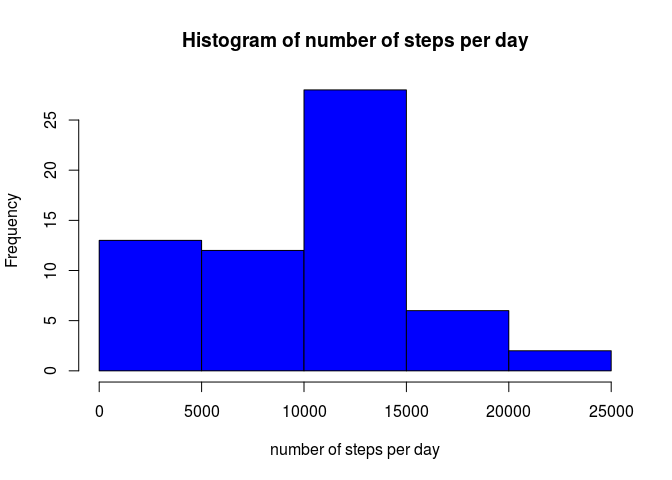
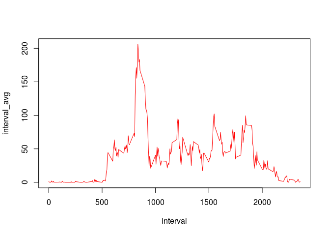
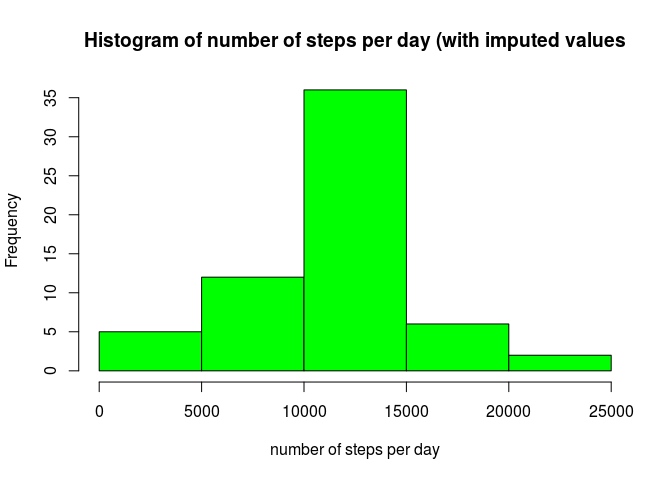
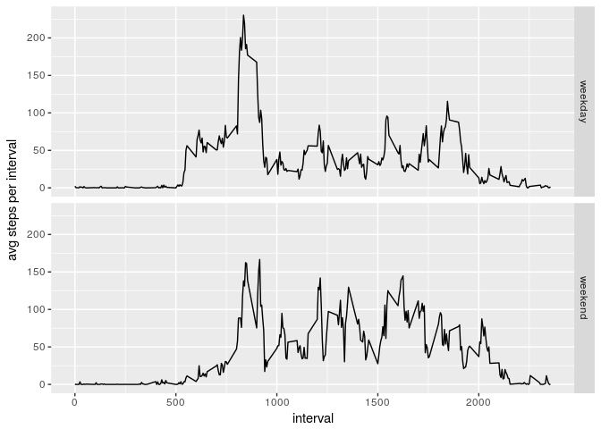

# RepData PeerAssessment1


```r
activity <- read.csv("activity.csv")
activity$date <- as.Date(activity$date)
```


```r
library(dplyr)
activity.daysum <- activity %>% select(steps:date) %>% group_by(date) %>% summarize(daysum = sum(steps, na.rm=TRUE))
hist(activity.daysum$daysum, main = "Histogram of number of steps per day", xlab = "number of steps per day", col="blue")
```

<!-- -->

```r
meanperday <- mean(activity.daysum$daysum)
medianperday <- median(activity.daysum$daysum)
```

The mean number of steps per day is 9354.2295082 and the median is 10395

Here we are looking at the daily activity pattern, where we are averaging the number of steps in a 5min interval over all days.
Below is a plot of this daily activity pattern.


```r
activity.int_avg <- activity %>% select(steps,interval) %>% group_by(interval) %>% summarize(interval_avg = mean(steps, na.rm = TRUE))
with(activity.int_avg, plot(interval, interval_avg, type = 'l', col = 'red'))
```

<!-- -->

```r
max_steps_interval <- activity.int_avg$interval[which.max(activity.int_avg$interval_avg)]
```

The maximum number of steps averaged across all days occurs in interval number 835.


```r
activity.imputed <- activity
for (i in 1:length(activity$steps)) {
  if (is.na(activity$steps[i])) {
    for (j in 1:length(activity.int_avg$interval)) {
      if (activity$interval[i] == activity.int_avg$interval[j]) {
        activity.imputed$steps[i] = activity.int_avg$interval_avg[j]
      }
    }
  }
}
activity.imputed.daysum <- activity.imputed %>% select(steps:date) %>% group_by(date) %>% summarize(daysum = sum(steps, na.rm=TRUE))
hist(activity.imputed.daysum$daysum, main = "Histogram of number of steps per day (with imputed values", xlab = "number of steps per day", col="green")
```

<!-- -->

```r
meanperday.imputed <- mean(activity.imputed.daysum$daysum)
medianperday.imputed <- median(activity.imputed.daysum$daysum)
```

For the dataset with imputed values, the mean number of steps per day is 1.0766189\times 10^{4} and the median is 1.0766189\times 10^{4}.  
The mean and the median for the imputed dataset are both larger than in the original dataset, meaning that the missing values occured more often in above-average intervals. There are also more values, which usually means that the mean and median are closer in value, which is true in this case, and that the total daily number of steps is greater.


```r
dayname <- weekdays(as.Date(activity.imputed$date))
for (i in 1:length(activity.imputed$steps)) {
  if (dayname[i] == "Saturday" || dayname[i] == "Sunday") {
    activity.imputed$daytype[i] <- "weekend"
  } else {
    activity.imputed$daytype[i] <- "weekday"
  }
}
activity.daytypeAvg <- activity.imputed %>% select(steps,interval,daytype) %>% group_by(interval, daytype) %>% summarize(interval_avg = mean(steps, na.rm = TRUE))
library(ggplot2)
qplot(interval, interval_avg, data=activity.daytypeAvg, facets=daytype~., geom = "line", ylab = "avg steps per interval")
```

<!-- -->

